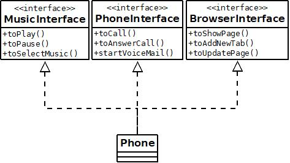

# [DIO](www.dio.me) - Trilha Java Básico

## POO - Desafio

### Modelagem e Diagramação de um Componente iPhone

Neste desafio, você será responsável por modelar e diagramar a representação UML do componente iPhone, abrangendo suas funcionalidades como Reprodutor Musical, Aparelho Telefônico e Navegador na Internet.

#### Contexto
Com base no vídeo de lançamento do iPhone de 2007 (link abaixo), você deve elaborar a diagramação das classes e interfaces utilizando uma ferramenta UML de sua preferência. Em seguida, implemente as classes e interfaces no formato de arquivos `.java`.

[Lançamento iPhone 2007](https://www.youtube.com/watch?v=9ou608QQRq8)
- Minutos relevantes: 00:15 até 00:55

#### Funcionalidades a Modelar
1. **Reprodutor Musical**
   - Métodos: `tocar()`, `pausar()`, `selecionarMusica(String musica)`
2. **Aparelho Telefônico**
   - Métodos: `ligar(String numero)`, `atender()`, `iniciarCorreioVoz()`
3. **Navegador na Internet**
   - Métodos: `exibirPagina(String url)`, `adicionarNovaAba()`, `atualizarPagina()`

### Objetivo
1. Criar um diagrama UML que represente as funcionalidades descritas acima.
2. Implementar as classes e interfaces correspondentes em Java (Opcional).

### Diagrama UML

 
<caption>Diagrama criado com a ferramenta <a href="http://dia-installer.de/">DIA</a></caption>

## Instruções para Execução do Programa

### Estrutura

O workspace contém dois diretórios, onde:

- `src`: o diretório com o código-fonte.
- `lib`: o diretório com as bibliotecas e demais dependencias.

Os arquivos compilados (bytecodes) serão gerados na pasta `bin` por padrão.

> Se houver necessidade de customizar a estrutura de diretórios abra `.vscode/settings.json` e modifica as configurações necessárias.

## Gerenciamento de Dependêcias

The `JAVA PROJECTS` view allows you to manage your dependencies. More details can be found [here](https://github.com/microsoft/vscode-java-dependency#manage-dependencies).